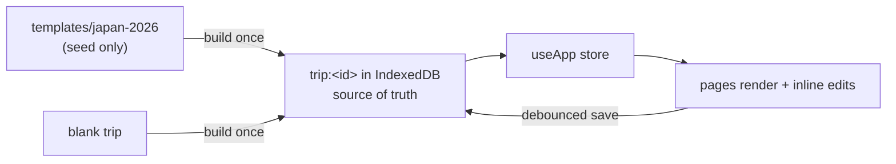

<div align="center">
  
  <h1>Zukness Atlas</h1>
  <p><em>A private, offline-first travel companion. One app, many trips —<br/>each one a little book you actually enjoy opening every morning.</em></p>
</div>

---

The first trip inside it is **Japan 2026** (Tokyo → Lake Kawaguchiko → Kyoto → Tokyo).
It also serves as the built-in template for the next one.

## What it does

| Module | |
|---|---|
| **Today** | A calm dashboard — where you are, days left, what's next (train, hotel, reservation, luggage), sunset & weather notes, a cover photo. |
| **Itinerary** | Every day of the trip, from a bird's-eye ribbon down to the hour-by-hour plan. |
| **Places** | Where you sleep, how you move, where the bags are. Each hotel carries its nearest station / konbini / pharmacy / ATM / courier — one tap into Google Maps. |
| **Explore** | Collections to browse like a magazine (autumn foliage, coffee, temples, gardens, scenic trains…) plus a guide page per day trip. |
| **Vault** | Documents (metadata only — passport scans never leave the device), packing, etiquette, notes. |
| **Manage** | The back office: create / duplicate / archive / switch trips, set dates & timezones, pick a theme, upload branding, reorder or hide modules. |

Everything works on a plane. Install it to your home screen and it behaves like a native app.

## Principles

- **Data-driven.** Dates, hotels, journeys, collections, colours, branding, even which modules appear — all editable from the UI. You never touch source to change a trip.
- **Inline editing.** Tap a value, change it, done. Manage is only for structure.
- **Offline-first.** Trip data lives on the device (IndexedDB, with a `localStorage` fallback). The service worker precaches the shell.
- **Fast & light.** No animation library, route-level code splitting, ~96&nbsp;KB of JS gzipped.
- **Quiet aesthetic.** Ink on paper, one vermillion accent, generous whitespace, a serif for display.

## Tech

React 18 · TypeScript · Vite · Tailwind · `vite-plugin-pwa` (Workbox) · Zustand · `idb-keyval`. No backend.

## Getting started

```bash
npm install
npm run dev          # http://localhost:5173
```

| Script | |
|---|---|
| `npm run dev` | dev server |
| `npm run build` | production build → `dist/` |
| `npm run preview` | serve the build locally |
| `npm run typecheck` | `tsc --noEmit` |

### Optional environment — `.env.local`

```ini
VITE_GMAPS_EMBED_KEY=   # Google Maps Embed API key (free) — restrict it by HTTP referrer
VITE_MYMAP_MID=         # a shared Google "My Map" id
```

Both are optional. Without them the app falls back to "Open in Google / Apple Maps" links.

## How the data works



- A **template** is just a function returning a fresh `TripData`. Editing template files only affects *new* trips.
- Once a trip exists, its whole dataset lives under `trip:<id>` and is yours to edit.
- `src/lib/storage.ts` is the only module that touches storage — swap it for a cloud adapter later and nothing else changes.

**Add a trip** from the app: *Manage → Trips → New trip* (blank, or from a template).

**Ship a new template** in code: add a folder under `src/templates/` exporting `buildTemplate(): TripData`, then register it in `src/templates/registry.ts`.

## Project layout

```
src/
  core/types.ts       domain types (trip-agnostic)
  lib/                 storage · dates · search · theme · media
  store/useApp.ts      trips + active trip + every mutation
  components/          shell · Hero · Editable · Icon · …
  routes/              one file per page
  templates/
    registry.ts         available templates (optional)
    japan-2026/          the built-in example trip
scripts/make_icons.py   regenerates brand assets from logo.png
```

## Deploy

Built for **Cloudflare Pages** + **Cloudflare Access** so only invited Google accounts can open it.

1. Push to GitHub, connect the repo in Cloudflare Pages.
2. Build command `npm run build`, output directory `dist`.
3. Zero Trust → Access → add a self-hosted app for the `*.pages.dev` host with a policy allowing your emails.
4. *(optional)* add the two `VITE_*` variables in the Pages project settings.

`public/_redirects` and `public/_headers` already handle SPA routing and caching.

## Branding assets

`logo.png` at the repo root is the source. Regenerate every icon and favicon size:

```bash
python3 scripts/make_icons.py
```

Per-trip logos and covers are uploaded in the app (*Manage → Media*) and stored with the trip.

---

<sub>Private project — not for redistribution.</sub>
